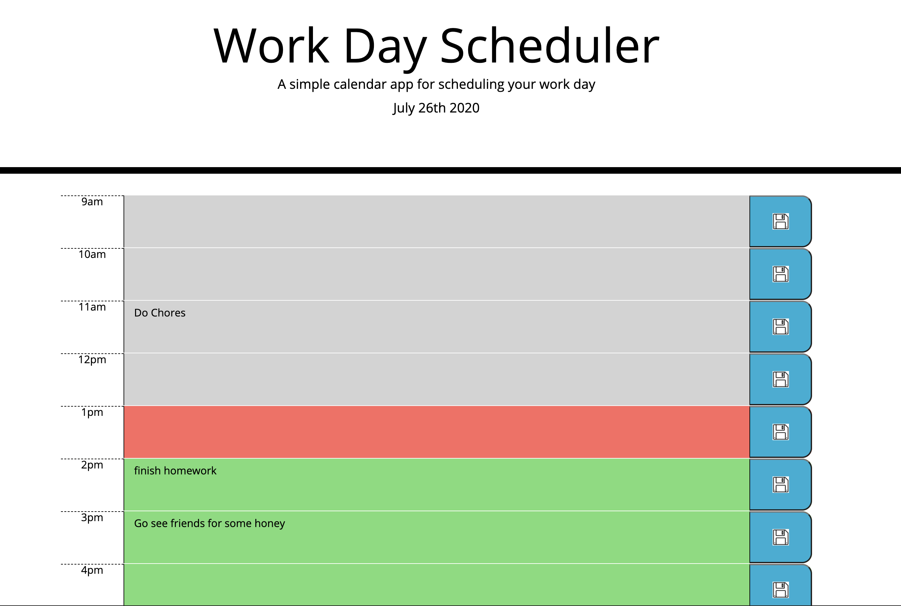

# WorkDayPlanner

# Links:
Repo: https://github.com/jttilley/WorkDayPlanner
Deployed: https://jttilley.github.io/WorkDayPlanner/index.html

# Technologies used:
HTML, CSS, Javascript, Bootstrap, FontAwesome, Moment.js

# Objective: 
Write the javascript to create the hour sements and allow the hourly schedule notes to be saved on local storage. Also color code the hours based on the current hour to be past, present, or future. 

# What I did:
* I added the pieces to each hour. 
* Used a for loop to create the buisness hour segments
* Added an image to the save button to show where to click to save the updated notes for each hour
* I made it so it deletes the hour segments that are empty from the local storage. 

# Screen shot:

# Functionality Demo:

# Author:
* **Jason Tilley** - *java script*
* **Denver University Bootcamp** - *HTML, CSS*

# License
*MIT* © 2020 Jason Tilley